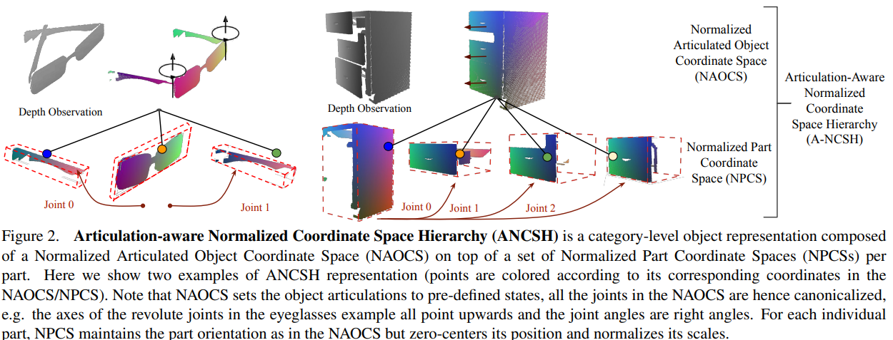
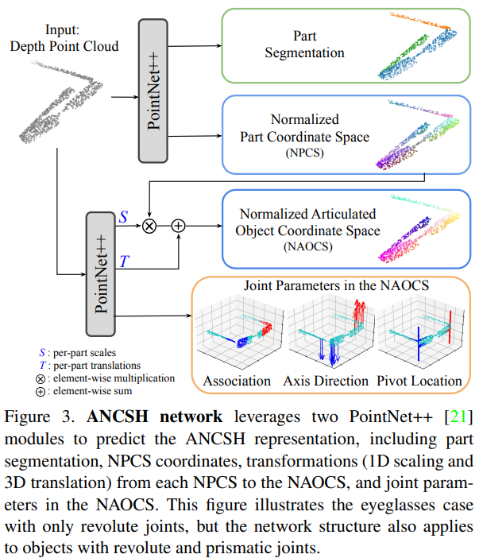

# 王鹤的 Pose Estim 方向

银河机器人 Galbot 是发展非常快的一家独角兽机器人公司。王鹤是该公司的掌舵者，在北大具身智能有非常rising的地位。

而王鹤也是开创了 category-level object pose estim 的方向。

如下几篇 paper 将逐个深入击破，让我们了解一下 6D Pose estim 的方向。一般而言， 6D Pose estim 所指的方向是 平移位置 $(x, y, z)$ 旋转姿态 $(\theta, \phi, \psi)$ Euler 角的估计。其实实际上就是去估计一个 4 * 4 的 matrix，包括旋转矩阵 $R$ （Euler 角用三维就可以得到）和三维平移向量 $t$。

传统的 6D pose estim 是 Instance level，对每一个物体都需要确定的 CAD 模型，而王鹤这些work则把 6D pose estim 从 Instance 实例 level 上升到 Category level。

其本质思想就是：**只要见过这个相机，图里所有的相机我都可以估计出来位姿！**，而不是往常的——对佳能相机需要一个 CAD模型，对尼康也是一个 CAD，等等等等.....而是说见过相机，就可以对任何款式或者品牌的相机进行位姿估计！

也就是说，Instance level 就是佳能款式1、2; 尼康款式1、2... 都要一个 CAD 模型，而 Category level 则是所有相机都可以估计！

## NOCS：6D pose estim 进入 Category 时代

传统的 Instance-level 的位姿估计需要 Object 确切的 CAD 模型，这就非常有局限性。我们能否在已知 class 但未知 CAD 的模型条件下估计出pose？就像刚才说的换了另一个款式的相机。

虽然目标检测，也就是估计物体 class 类别和 bounding box 不需要知道 CAD 模型，但是 bounding box 立方体依赖于观测的视角。需要估计的目标，也就是 6D pose 和 3D scale。

1. **既然我们对同类新物体不知道 CAD 模型，那如何把不同实例同类的物体用一个表征表示出来？**
2. **很多 dataset 都缺乏有关 6D pose + 3D scale 的 annotation 标注，怎么办？**

于是作者提出了 Normalized Object Coordinate Space (NOCS)，也就是统一化的物体坐标空间。

- 所有物体都有一个 Normalized 空间。
- 所有同属一个 Category 的物体在这里是一个一致统一的大小朝向的。

作者是用一个 CNN 对一张图中预测出多个 object 的所属类别 class、object 分割的 mask、NOCS map 三者同时估计出。

随后，NOCS map 和 深度 map 二者联合，估计出物体的 6D pose 和 3D scale。

**作者还构造了一个数据集**，提出了一种上下文感知的混合现实方式生成数据集，包含标注——

- class label
- instance segment mask
- NOCS map
- 6D pose + 3D size

并且提出了一个real的dataset，用于训练和测试。

实际上在此之前：Category level 的到达了目标检测，也就是输出 bounding box；估计pose 的更多依赖于 instance，必须要有每一个 instance 实例的 CAD 的物体模型。而 Pose estim 更是只有 4 DoF。

- 4 DoF 的话旋转就只有一维，就是被简化为了 Roll Pitch 和 Yaw 中只有 Yaw 也就是绕着重力方向的轴旋转
- 且原先的方法都限于大尺寸的物体，没有考虑到物体的对称性。

### NOCS 的方法

NOCS 的估计包含 Rotation(3D) + Translation(3D) + Scale(3D)。模型虽然没见过这个物体本身，但是见过与其同类的，从而要把其迁移泛化出来。

那什么是 NOCS map 呢？其实就是一个 3D space 的单位立方体，也即 $(x, y, z)\in [0, 1]^3$。对于一类已知类别的物体的 CAD 模型：

- scale 尺寸归一化，使得 3D bounding box 紧密包住之，并放在 NOCS 空间
- 物体中心和方向一致对齐，用来自 ShapeNetCore 的模型。在尺度、位置和方向上进行了规范化
- 作者的 CNN 模型，预测颜色编码的 NOCS 坐标的二维透视投影，其实为物体可见部分在 NOCS 中的形状重建。也就是说，其颜色 (r, g, b) 的值就是 (x, y, z) 的值（范围为0-1，也就是 (x, y, z) = (r, g, b) = (1, 1, 1) ，对应显示为白色）

**也就是说，你看到的 NOCS map 图片里像素 rgb 的值就是在 3D [0, 1] 空间坐标的位置值**

即使物体仅部分可见，NOCS 表示方法仍然有效，比其他方法（如bounding box）更鲁棒。

### 整体过程

整体网络架构如下：

- 输入： RGB 图像 + D 深度图
- CNN 输出预测目标：class label、NOCS map、Instance Mask（segment）
- Depth 深度 + Instance Map + NOCS map 预测出 pose！

CNN 中没有使用 Depth，因为像 COCO 这样的 dataset 没有 depth，是为了探索一下无depth的效果。作者的 CNN 是以往目标检测 Kaiming 的 Mask RCNN 的架构。

### Dataset 构造

NYU、SUN 这些数据集只有 3D bbox，没有 6D pose。那作者对于这些怎么去做的?

作者使用的是上下文感知混合现实 （CAMERA）方法，将真实背景图像与合成渲染的前景物体以上下文感知的方式结合，即合成物体以合理的物理位置、光照和尺度渲染并合成到真实场景中，从而可以生成更多的 训练数据。下面举一个例子

- 一张背景图片，是一张桌子，对应一个 detected 检测的一个平面
- 一些物体（如锅、碗、等）增加一些角度灯光，基于 ShapeNetCore 得到合成物体
- 生成：合成图片（gt 背景 + 合成物体）、gt depth、gt mask、gt NOCS map
  有 Mixed - reality 就是背景图里在空桌上平面，随机加入一些合成的物体贴图；还有real world 就是现实的桌子上摆物体
  。如下图所示。

### 网络架构过程

作者使用了 Mask-RCNN，有2个模块——一个提出 RoI，一个检测区域内物体。作者对其修改如下

- 增加了3个 head 架构，分别预测 class_label、NOCS map、Instance mask。
- 对于 NOCS map 的预测，相比直接 regression 连续，用了离散化的 classification，选取 32 个 class 。
- Loss func：预测 label、instance mask 的和原 Mask-RCNN 的loss 一致，对于 NOCS head 的 loss 在 Softmax 和 SmoothL1 中选择。

**另外，对于一些对称的物体**，比如圆的瓶子那么怎么都对称。每个类别定义一个对称轴，围绕该轴旋转角度 $\theta$。例如一个长方形旋转 0, 90, 180, 270 生成一样 NOCS 图。没有对称轴的物体则只有 $\theta=0$，于是生成围绕对称轴旋转 $|\theta|$次 生成多个 GT 的 NOCS 图，预测 predicted 的 NOCS map 与这多个 GT 的loss 取min。作者发现一般$\theta$ 取 6 左右就可以应对大多数 object 了。

### Experiment

作者的 Metric 为：

- 3D 目标检测和尺寸估计：IoU
- 6D pose estim：Translation error 和 Rotation error
  作者把目标检测和位姿估计解耦。NOCS图提供了物体形状、部分和可见性的详细信息，显著提高了6D位姿和尺寸估计的精度

---

## ANCSH: 从刚体到关节类物体

相较于刚体，关节类物体的组成更为复杂。关节类物体有很多关机相连，通过关节相连的每一个部分都可以看作是一个单独的物体，而每一个部分之间又存在着制约关系。如何仅利用深度深度图像对关节目标进行类别级位姿估计的问题？

上一篇的 NOCS 是对同一个 class 的 object 给出了一套规则化的方法，使用 NOCS 到相机空间的变换来定义每个object的pose和scale。

**但是对关节物体，更需要关注的是每个独立部件和关节的姿态以及状态！**。比如有一个保险箱，那箱门和箱体的铰接关节就需要独立出来考虑的 2个 部件。

比如，一个眼镜，就分为3个part，一个是镜框，另两个是镜腿。同样为了解决同Category中可能缺乏 CAD 准确建模图的情况。

作者需要解决：同一类别中的不同实例找到一种共享表示（和NOCS差不多，但还要对每个关节以及关节与关节之间建模）、姿态估计和关节约束（因为刚体相当于只有一个，关节的物体则视为多个刚体，之间有约束就使得自由度更复杂。如何约束旋转关节和平移关节，并且对每个关节准确估计姿态并符合物理约束）

**表示挑战**
作者提出了关节感知Normalized 层次坐标空间 (ANCSH)，是一个两级层次结构的规范空间

- root level 上是 NAOCS，就是差不多原来的 NOCS
- leaf level 上是 NPCS，是每个part 的坐标空间。
  NAOCS中物体的 scale、rotation 方向还有 joint state 归一化，而每个刚体 NPCS 则部件的 state 和 scale 归一化。前者提供物体规范的参考，而后者偏向部件规范参考。

**姿态估计**
将物体分割为多个刚性部件，并预测其在ANCSH中的归一化坐标。但这里刚性的部件之间的连接需要符合物理约束，于是从观测中估计NAOCS中的关节参数，根据关节类型对约束建模，利用运动学先验来正则化部件姿态。

### 过程问题

输入为来自单个深度图的 3D 点云 $P = (p_i)_{1\leq i\leq N}, p_i\in \mathbb{R}^3$。假设 $N$是点个数，整个一个物体是 $M$ 个刚体部分，以及 $K$ 个关节。则我们的目标

- 将点云分割为 $M$ 个刚体部分 $S_i$，
- 把每一个部分的 $(R_i, t_i, s_i)_{1\leq i \leq M}$ 这三个 Rotation + Translation + Size 估计出来
- 并把每一个关节 $(\phi_k, \theta_k)_{1\leq i \leq K}$ 预测。注意这里假设了旋转是 2个参数，一个是旋转一个是平移（比如书柜，有的关节约束是平移抽拉，有的关节约束是开门旋转）
  - 如果是旋转关节，则关节参数包含 旋转转轴方向，和 pivot 固定枢轴点，关节状态定义为两个连接部件之间沿旋转轴方向的相对旋转角度
  - 如果是平移关节，就是一个平移轴的方向。关节状态定义为两个连接部件之间沿平移轴方向的相对平移距离。

### ANCSH 表征

ANCSH 是接着 NOCS 的方法，NOCS 是一个 3D 空间单位立方体，用于估计刚性物体的类别级 6D 姿态和大小。物体在 NOCS 中通过其方向进行一致对齐。并且被零中心化，均匀缩放、使得紧密边界框都位于 NOCS 的原点且对角线长度为1。

而为了定义类别级的部件姿态和关节属性就提出了 ANCSH，是一个两级层次结构的归一化坐标空间。

- NAOCS：为了为物体集合构建一个类别级的物体参考框架，将所有物体的关节状态设置为预定义的静止状态（就是相当于关节 joint rotation 的 0度，joint translation 的 0）。比如眼镜，则定义两个旋转关节的静止状态定义为直角，抽屉的静止状态定义为关闭。也就是说对于 Root 在 NOCS 基础上（中心、方向、缩放对齐）的基础上加上一个关节初始化。
- NPCS：将每个连接部件同样是满足NOCS的中心、方向、缩放三者对齐，然后保持方向与 NAOCS 的方向一致。类似于 NOCS 不过改成是针对单个部件而不是整个物体。不同物体实例中对应的部件在 NPCS 中是对齐的，从而促进了类内能够泛化。

### 网络架构

作者使用了 2 个 PointNet++ 网络。

- 第一个预测 每部分的分割 + 每一块的 NPCS，也即包含分割、NPCS map坐标、从 NPCS 到 NAOCS 的变换（Scaling + Translation）
  - 对于点云里每个点 $p_i$，NPCS head 输出 $M$ 个 3D 坐标，也就是 $c_i^j, 1\leq j \leq M$。然后用 predicted label 选择出对应的 NPCS。这么做可以提供一些几何先验，且这两个 PointNet++ 的 backbone 共享。
- 第二个 PointNet++ 从每一个关节部分的 NPCS 中预测的 Saling 加上 Translation 后得到 NAOCS，同时再预测一个 NAOCS 中的关节参数（关联位置、轴方向）
  - NAOCS 的 head 预测每个 $G^j$ 就是从每一个 NPCS 到 NAOCS 的变换，这里 $G^j = (G_t^j, G_s^j)$，也就是一个 3D 向量和一个 Scaling 因子。仍然考虑 $p_i$ 每个点。NAOCS坐标也就是 $g_i = G_{si} c_i + G_{ti}$，然后对 $p_i \in S^j$ 也就是第 $j$ 号 part 的求均值。
  - 最后一个head 预测关节参数

Loss func：分割部分用 IoU loss，NPCS map 为 L2 regression，NAOCS 的 Scale 和 Trans 都为 L2 regression，IoU 再次用于 joint 关联损失，最后 joint 参数再次用 L2 regression。总的来说：

- 每个 $p_i$ 输出 $c_i$ 为 NPCS 预测目标
- 每个 NPCS space  $S^j$ 输出 $G_t^j, G_s^j$ 变换到 NAOCS 的参数
- 每个 joint $J_k$ 输出 $\phi_k$ 关节参数。

下面开始估计 Pose

### Pose 估计

给定以上所得我们要得到每一个 part $S^j$ 的 pose，也就是 $R_j, t_j, s_j$ 三个参数。这个是什么过程？我们获取的输入：

- 各个部分分割的 mask 结果
- 每个点云点 $p_i$ 的 NPCS 坐标 $c_i^j$
- 每个部分 $S^j$ 中 NPCS 到 NAOCS 的变换 $G_t^j, G_s^j$
- 每个关节 $J_k$ 的参数（变换角度这些）$\phi_k$

对每个 $S^j$ 部分，属于这一部分的点 $p_i \in S^j$，我们有对应的 $c_i$ 也就是 NPCS map 值的预测。则

$e_j = \frac{1}{|S^j|} \sum_{p_i\in S^j}\|p_i - (s^j R^j c_t + t_j)\|_2^2$s

