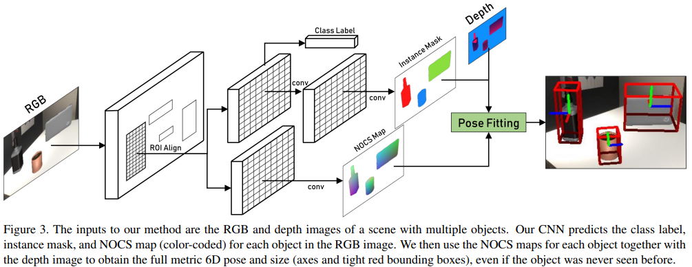
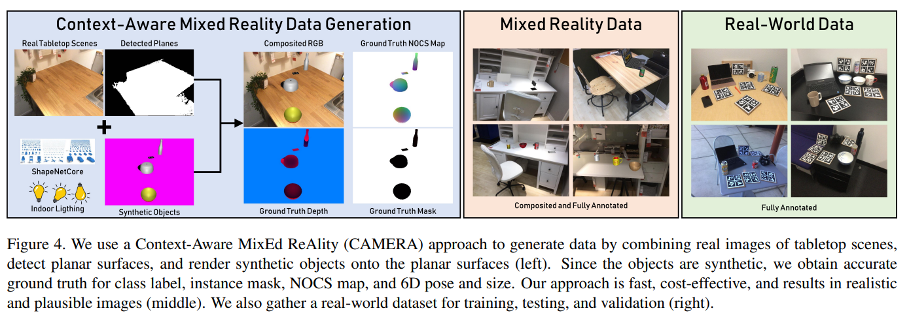

# 王鹤的 Pose Estim 方向

银河机器人 Galbot 是发展非常快的一家独角兽机器人公司。王鹤是该公司的掌舵者，在北大具身智能有非常rising的地位。

而王鹤也是开创了 category-level object pose estim 的方向。

如下几篇 paper 将逐个深入击破，让我们了解一下 6D Pose estim 的方向。一般而言， 6D Pose estim 所指的方向是 平移位置 $(x, y, z)$ 旋转姿态 $(\theta, \phi, \psi)$ Euler 角的估计。其实实际上就是去估计一个 4 * 4 的 matrix，包括旋转矩阵 $R$ （Euler 角用三维就可以得到）和三维平移向量 $t$。

传统的 6D pose estim 是 Instance level，对每一个物体都需要确定的 CAD 模型，而王鹤这些work则把 6D pose estim 从 Instance 实例 level 上升到 Category level。

其本质思想就是：**只要见过这个相机，图里所有的相机我都可以估计出来位姿！**，而不是往常的——对佳能相机需要一个 CAD模型，对尼康也是一个 CAD，等等等等.....而是说见过相机，就可以对任何款式或者品牌的相机进行位姿估计！

也就是说，Instance level 就是佳能款式1、2; 尼康款式1、2... 都要一个 CAD 模型，而 Category level 则是所有相机都可以估计！

## NOCS：6D pose estim 进入 Category 时代

传统的 Instance-level 的位姿估计需要 Object 确切的 CAD 模型，这就非常有局限性。我们能否在已知 class 但未知 CAD 的模型条件下估计出pose？就像刚才说的换了另一个款式的相机。

虽然目标检测，也就是估计物体 class 类别和 bounding box 不需要知道 CAD 模型，但是 bounding box 立方体依赖于观测的视角。需要估计的目标，也就是 6D pose 和 3D scale。

1. **既然我们对同类新物体不知道 CAD 模型，那如何把不同实例同类的物体用一个表征表示出来？**
2. **很多 dataset 都缺乏有关 6D pose + 3D scale 的 annotation 标注，怎么办？**

于是作者提出了 Normalized Object Coordinate Space (NOCS)，也就是统一化的物体坐标空间。
- 所有物体都有一个 Normalized 空间。
- 所有同属一个 Category 的物体在这里是一个一致统一的大小朝向的。

作者是用一个 CNN 对一张图中预测出多个 object 的所属类别 class、object 分割的 mask、NOCS map 三者同时估计出。

随后，NOCS map 和 深度 map 二者联合，估计出物体的 6D pose 和 3D scale。

**作者还构造了一个数据集**，提出了一种上下文感知的混合现实方式生成数据集，包含标注——
- class label
- instance segment mask
- NOCS map 
- 6D pose + 3D size

并且提出了一个real的dataset，用于训练和测试。

实际上在此之前：Category level 的到达了目标检测，也就是输出 bounding box；估计pose 的更多依赖于 instance，必须要有每一个 instance 实例的 CAD 的物体模型。而 Pose estim 更是只有 4 DoF。
- 4 DoF 的话旋转就只有一维，就是被简化为了 Roll Pitch 和 Yaw 中只有 Yaw 也就是绕着重力方向的轴旋转
- 且原先的方法都限于大尺寸的物体，没有考虑到物体的对称性。

### NOCS 的方法

NOCS 的估计包含 Rotation(3D) + Translation(3D) + Scale(3D)。模型虽然没见过这个物体本身，但是见过与其同类的，从而要把其迁移泛化出来。

那什么是 NOCS map 呢？其实就是一个 3D space 的单位立方体，也即 $(x, y, z)\in [0, 1]^3$。对于一类已知类别的物体的 CAD 模型：
- scale 尺寸归一化，使得 3D bounding box 紧密包住之，并放在 NOCS 空间
- 物体中心和方向一致对齐，用来自 ShapeNetCore 的模型。在尺度、位置和方向上进行了规范化
- 作者的 CNN 模型，预测颜色编码的 NOCS 坐标的二维透视投影，其实为物体可见部分在 NOCS 中的形状重建。也就是说，其颜色 (r, g, b) 的值就是 (x, y, z) 的值（范围为0-1，也就是 (x, y, z) = (r, g, b) = (1, 1, 1) ，对应显示为白色）

**也就是说，你看到的 NOCS map 图片里像素 rgb 的值就是在 3D [0, 1] 空间坐标的位置值**

即使物体仅部分可见，NOCS 表示方法仍然有效，比其他方法（如bounding box）更鲁棒。

### 整体过程

整体网络架构如下：
- 输入： RGB 图像 + D 深度图
- CNN 输出预测目标：class label、NOCS map、Instance Mask（segment）
- Depth 深度 + Instance Map + NOCS map 预测出 pose！

CNN 中没有使用 Depth，因为像 COCO 这样的 dataset 没有 depth，是为了探索一下无depth的效果。作者的 CNN 是以往目标检测 Kaiming 的 Mask RCNN 的架构。

### Dataset 构造

NYU、SUN 这些数据集只有 3D bbox，没有 6D pose。那作者对于这些怎么去做的?

作者使用的是上下文感知混合现实 （CAMERA）方法，将真实背景图像与合成渲染的前景物体以上下文感知的方式结合，即合成物体以合理的物理位置、光照和尺度渲染并合成到真实场景中，从而可以生成更多的 训练数据。下面举一个例子

- 一张背景图片，是一张桌子，对应一个 detected 检测的一个平面
- 一些物体（如锅、碗、等）增加一些角度灯光，基于 ShapeNetCore 得到合成物体
- 生成：合成图片（gt 背景 + 合成物体）、gt depth、gt mask、gt NOCS map
有 Mixed - reality 就是背景图里在空桌上平面，随机加入一些合成的物体贴图；还有real world 就是现实的桌子上摆物体
。如下图所示。

### 网络架构过程

作者使用了 Mask-RCNN，有2个模块——一个提出 RoI，一个检测区域内物体。作者对其修改如下
- 增加了3个 head 架构，分别预测 class_label、NOCS map、Instance mask。
- 对于 NOCS map 的预测，相比直接 regression 连续，用了离散化的 classification，选取 32 个 class 。
- Loss func：预测 label、instance mask 的和原 Mask-RCNN 的loss 一致，对于 NOCS head 的 loss 在 Softmax 和 SmoothL1 中选择。

**另外，对于一些对称的物体**，比如圆的瓶子那么怎么都对称。每个类别定义一个对称轴，围绕该轴旋转角度 $\theta$。例如一个长方形旋转 0, 90, 180, 270 生成一样 NOCS 图。没有对称轴的物体则只有 $\theta=0$，于是生成围绕对称轴旋转 $|\theta|$次 生成多个 GT 的 NOCS 图，预测 predicted 的 NOCS map 与这多个 GT 的loss 取min。作者发现一般$\theta$ 取 6 左右就可以应对大多数 object 了。

### Experiment

作者的 Metric 为：
- 3D 目标检测和尺寸估计：IoU
- 6D pose estim：Translation error 和 Rotation error
作者把目标检测和位姿估计解耦。NOCS图提供了物体形状、部分和可见性的详细信息，显著提高了6D位姿和尺寸估计的精度

---

## ANCSH: 从刚体到关节类物体

相较于刚体，关节类物体的组成更为复杂。关节类物体有很多关机相连，通过关节相连的每一个部分都可以看作是一个单独的物体，而每一个部分之间又存在着制约关系。

如何仅利用深度深度图像对关节目标进行类别级位姿估计的问题？
