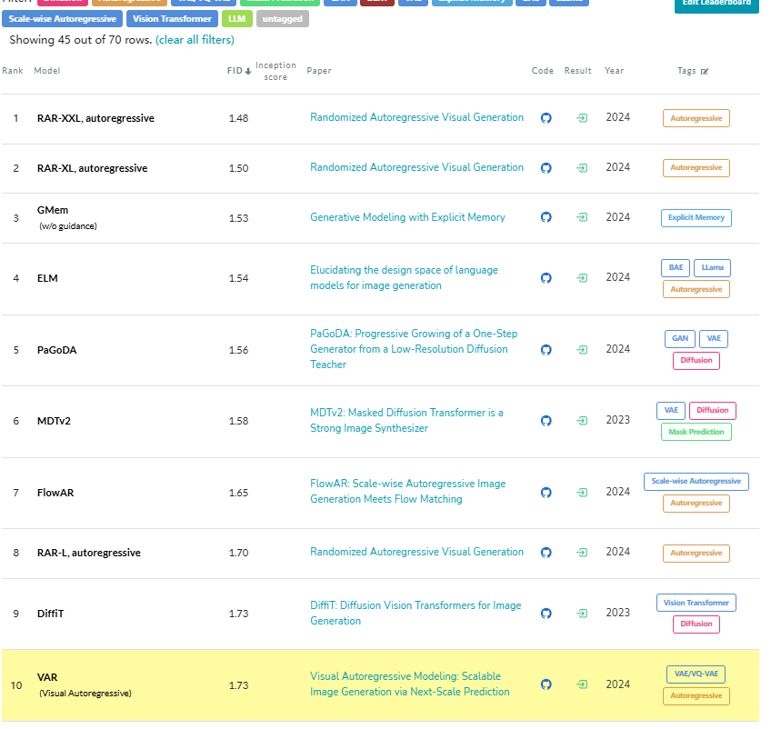
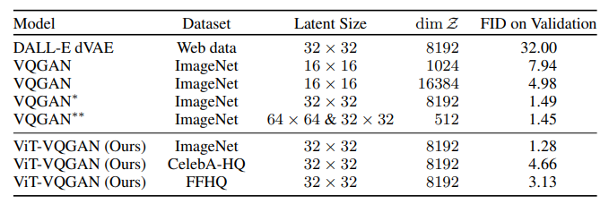
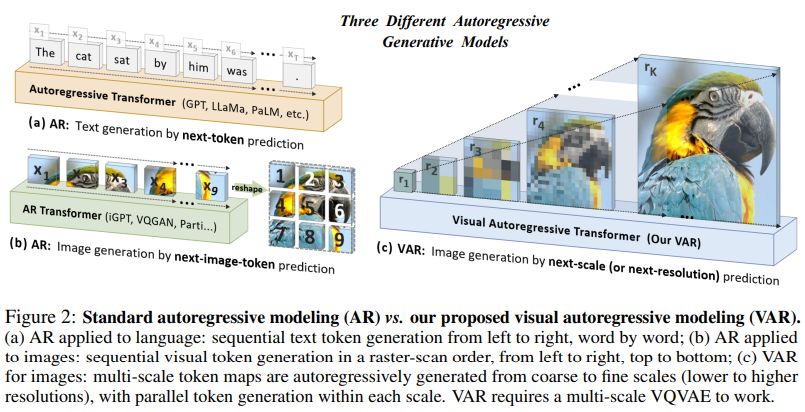
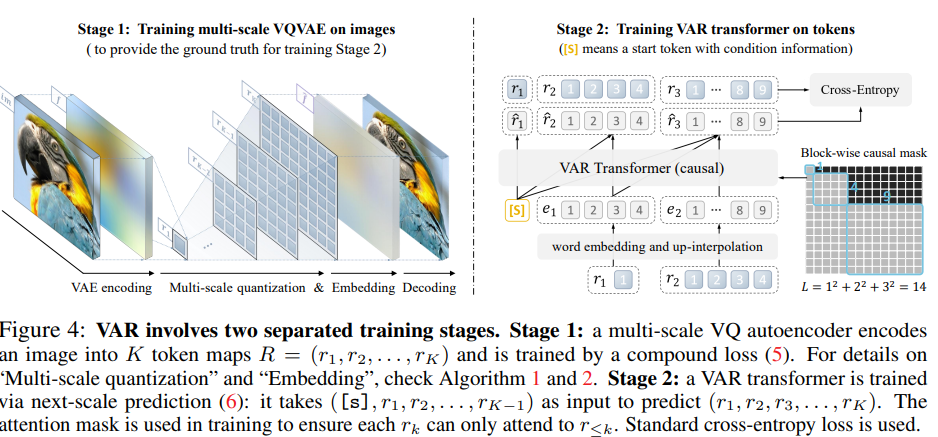
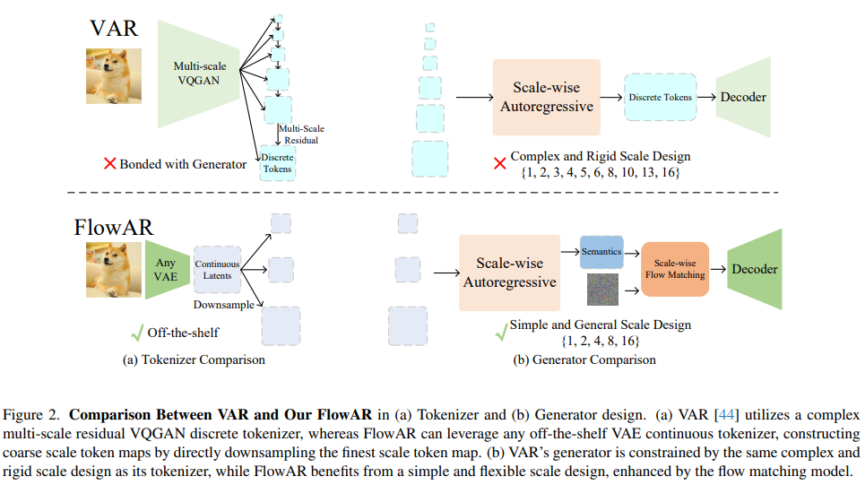

# 从VAR看 Autoregressive vs Diffusion 之潮 in Generation

大家都知道2024年，给字节集群投毒的 Keyu 的那一篇 VAR —— Nips 的 Best paper！顺着字节的集群投毒这一闹得沸沸扬扬的事，Best Paper 的消息一出，再一次震惊了整个AI之圈！

以往，我们都认为——Language理解看Transformer (GPT,  Llama...)，Image 生成看Diffusion (SD,  DiT....)

而字节此之work一出，如同 xLSTM ----- "被Transformer偷走的一切，我势必要杀回来"！

## Start from LlamaGen

2021年，Diffusion 击败 GAN 的结果，一定程度上使得数年以来 Diffusion 成为图像生成，AIGC之中的不二选择。

当然，21年 Kaiming 的 MAE ，也让生成学习中出现了 Mask learning 新的一范式，22年的 Flow matching 一定程度上改进了点Diffusion，只不过 Flow matching 和 Diffusion 大差不差。

**而 Autoregressive 这一在语言模型中主导的，特别 Transformer 作为主流的架构，却一度曾在图像生成领域中 “抬不起头”。**  Keyu 的 VAR 让Autoregressive 终于在图像生成中重新获得popularity！不过要说Autoregressive，你刷完 PaperWithCode 里 Imagenet 的 FID 榜单 ......

你会发现：除了VAR，还有 FlowAR 和 RAR！

并且进一步扒一下，你还会发现这些的作者都有————**字节！而且FlowAR 和 RAR还都是一个团队出品！**

好家伙——原来我死去的 VQGAN（Taming Transformer），被字节为代表的 Autoregressive 系列整复活了！

## 话不多说，看看LlamaGen吧

实际上，在自回归图像里面，开源社区主要还是在 VQGAN 里面 Imagenet FID=15 左右的结果。当然实际上，ViT-VQGAN 达到了媲美 Diffusion 系列的 3.0 左右。在很多图像生成的模型里，一般哪些设计很重要？

1. 将图像压缩到 Latent 空间的 Tokenizer（压缩或者量化）
2. 可以 scale 的图像生成模型

既然是LlamaGen，作者采用的Tokenizer ，实际上是和原来VQGAN 里的CNN 差不多的一个架构。不过参考借鉴了ViT-VQGAN的一个设置，作者发现：

**应该降低codebook的 每个vector的dim，增加codebook的size！**

我们假设图像是 `[H, W, 3]`的，则经过 Quantize，得到 `[h, w]`的 token。假设  $q\in Q^{h\times w}$，里面每个元素是$q_{(i,j)}$是 codebook里面的元素。

在图像的生成过程时，就是我们熟悉的自回归过程$\prod_{t=1}^{h\cdot w} (p_t|p_{<t}, c)$，$c$是 text / condition 的Embedding。

假设一个Codebook 为 $Z$，图像经过压缩$f = \text{Enc}(x)$，这里面$f$是一个Feature map。每个$f_{(i,j)}$ 都会找$Z$里距离$f_{(i,j)}$最近的vector作为$z_{(i,j)}$，同时返回$z_{(i,j)}$对应的 index 是 $q_{(i,j)}$。

其loss 是我们熟知的 $L_{\text{VQ}}=\|f-\text{sg}(z)\|_2^2 + \|\text{sg}(f)-z\|_2^2$，第一项是commitment loss，希望提取的feature map 更接近codebook。

**下一步**，在图像的 Latent 空间里执行一步一步生成，则用了Llama 大语言模型的架构。用RMSNorm的Prenorm、2D RoPE这些都保留了。Text 作为condition 嵌入用 T5-XL Encode 并一个小MLP进行align projection。而对于Image 的 Recounstruct，则是3个loss：L2、LPIPS、GAN（PatchGAN 的 Discriminator）的加权。Llama 的语言架构也允许其 Scale up。

**整体没啥，更多是在Tokenizer上的经验，借鉴了“高质量往往应该加点Size降点dim”的 ViT-VQGAN 的经验。主要偏Tokenizer，整体内部的backbone novelty不大。**

## 正片开始！VAR 来袭了！

这个，就是 Keyu 一战成名之Best Paper！

**自回归我们都知道——前面所有预测下一个**。类比 VQGAN、 或者刚才提到的 LlamaGen，大差不差其实都是 “一排一排” 生成。如果模型是一个画师，那这个画师的创作方式是一行一行序列的。就是先画上面再画下面。

但是VAR 从新角度提出的自回归——**scale 从 coarse 到 fine ！**

人们感知图像或进行绘画时，往往先概览全局、再深入细节。现代特别提倡的 “先完成，再完美” 不就是如此吗？先把整个图像的大致粗特征勾勒出完成整个图像outline，再进一步通过细化细节不断完美。传统的 AR 模型在生成领域逐行扫描，本质算是 “一次生成完美的结果”，但这种 “完美主义” 式的AR，本质上几乎等价于把图像做了 `flatten(-2, -1)` 操作，对于周边邻域关系一定程度上就被破坏。

直觉一听，仿佛想到了 CNN 相较于MLP，卷积核保留了图像的二维空间的依赖性。类似于VAR，即使是patchify，但本质仍逃不过逐行生成，对二维图像的空间局部性存在一定的破坏。

- 传统的 AR 一般都是前面的生成后面的，但是图像领域之中，后面的像素对前面的也有关系！这一能力的缺失，就存在诸如 “给定图像下面不能预测上面” 这样的问题。
- 传统的 AR 序列性，从左到右，从上到下，对图像的空间局部依赖性有一定的破坏。

**VAR 通过两阶段训练**
第一阶段是训练一个 Multi-scale 的 VQVAE。对 img 先通过 `feat = Encoder(img)` ，这个feat 就是 $f$；再通过 `q = Quantize(feat)`，得到离散化的 tokens $q$，其中
$q_{i,j}$ 通过 $\arg \min \|\text{lookup}(Z) - f_{i,j}\|^2$。

这个$q$是 Codebook 里所有 vector 的 index 的 map，然后根据最小距离 index 从Codebook 索引出对应向量 $\hat{f}$，最后通过Decoder解码出 Recounstruct 的image。这一部分的loss 是 Image Recounstruct 的 L2 + Feature Recounstruct 的 L2，加上 image 的 Gan 对抗loss 和 LPIPS 感知 loss！

## FAR:  VAR + Flow matching

VAR 面临的问题：

1. Next scale prediction 的泛化能力
2. Generator 需要相同复杂尺度结构的 Tokenizer，限制了Tokenizer 的灵活性

作者简化了Scale 的设计，每个后续尺度都是前一个尺度的两倍，这就大大降低了Tokenizer的复杂需求，且能够和任意VAE兼容。且结合了Flow matching

## RAR:  还有高手？
