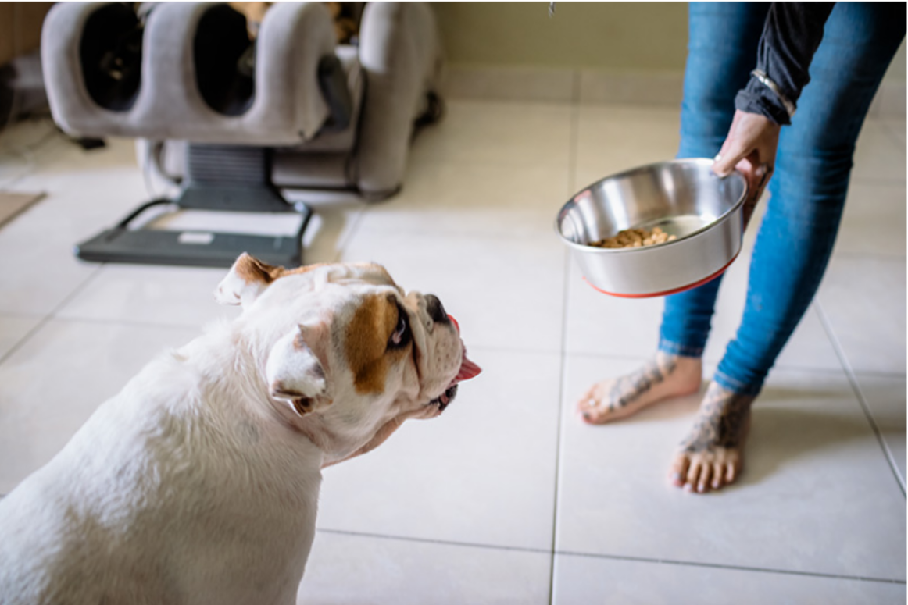
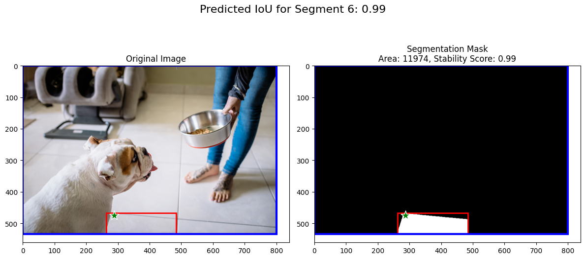

# SAM 复现

大家都知道 Meta AI 的 Segment Anything，是一个非常强大的图像分割模型。那里面代码涨了什么样？我们来看一看。

官方 repo 传送门：https://github.com/facebookresearch/segment-anything

参照官方的 README 阅读。老规矩，clone 到本地，然后 `pip install -e .` ，随后装一些依赖库。

```shell
git clone https://github.com/facebookresearch/segment-anything.git
cd segment-anything
pip install -e .
pip install opencv-python pycocotools matplotlib onnxruntime onnx
```

## 1: Demo 观察


按照官方的 README，我们首先要把模型的checkpoint下载下来，这个在下面：
```py
from segment_anything import sam_model_registry
sam = sam_model_registry["<model_type>"](checkpoint="<path/to/checkpoint>")
```
然后这里：`vit_h` 对应 ViT-Huge 模型，`vit_b` 就是 ViT-Base，而 `vit_l` 对应 ViT-Large。每一个都是点击一个链接。

我这里在这个 repo 大文件夹下面创建了一个 `ckpts` 文件夹，然后 三个ckpt放在了那里面。

```shell
mkdir ckpts && cd ckpts
wget https://dl.fbaipublicfiles.com/segment_anything/sam_vit_b_01ec64.pth # vit_b
wget https://dl.fbaipublicfiles.com/segment_anything/sam_vit_l_0b3195.pth # vit_l
wget https://dl.fbaipublicfiles.com/segment_anything/sam_vit_h_4b8939.pth # vit_h
```

随后文件夹关系是
```
.
├── CODE_OF_CONDUCT.md
├── CONTRIBUTING.md
├── LICENSE
├── README.md
├── assets
│   ├── masks1.png
│   ├── masks2.jpg
│   ├── minidemo.gif
│   ├── model_diagram.png
│   ├── notebook1.png
│   └── notebook2.png
├── ckpts
│   ├── sam_vit_b_01ec64.pth
│   ├── sam_vit_h_4b8939.pth
│   └── sam_vit_l_0b3195.pth
.....(余下的和原来一样)
```

例如，则我实际调用`vit_h`的时候就应是
```py
sam = sam_model_registry["vit_h"](checkpoint="./ckpts/sam_vit_h_4b8939.pth")
```


官方给出了 Demo，我们来看一下大致是什么效果，以及分割的数据都是哪些

### `SamAutomaticMaskGenerator` 大类

通过把图像 grid 网格化，将采样的 2D point 作为 prompt 输入，SAM 可以预测多个 mask，也就是这个物体的区域。

然后用 NMS 等 filter 一些 mask。我们传入一张图片：



现在我们输出分割结果：
```py
import sys
sys.path.append("..")
import numpy as np
import torch
import matplotlib.pyplot as plt
import cv2

from segment_anything import sam_model_registry, SamAutomaticMaskGenerator, SamPredictor


image = cv2.imread('images/dog.jpg')
image = cv2.cvtColor(image, cv2.COLOR_BGR2RGB)

sam_checkpoint = "../ckpts/sam_vit_h_4b8939.pth" 
model_type = "vit_h"

sam = sam_model_registry[model_type](checkpoint=sam_checkpoint).to(device="cuda") # 选取模型
mask_generator = SamAutomaticMaskGenerator(sam)
# 生成 mask 生成器这个对象，然后对象作用于实例
masks = mask_generator.generate(image)
masks
```

其输出结果是一个 `list`，内部是一个一个 `dict` 元素。每一个元素表示一个分割的 mask 信息，包含
- `segmentation`：是 Binary 的 mask 黑白图
- `area`：mask 的像素面积
- `bbox`: mask 的 bounding box，形式为 `[x, y, w, h]`
- `predicted_iou`：mask 的 iou 预测值
- `point_coords`：采样的点的坐标
- `stability_score`：mask 的稳定性评分
- `crop_box`：图像裁剪的部分，也是以 `[x, y, w, h]` 形式表示


比如，上面把 `masks` 打印出来：
```py
len(masks) # output: 66
masks[0].keys() # output: dict_keys(['segmentation', 'area', 'bbox','predicted_iou', 'point_coords', 'stability_score', 'crop_box'])
```

我们看一下，`point_coords` 在这个里面提取出来，然后都画出，看看什么样子：

```py
import matplotlib.pyplot as plt
import numpy as np
from PIL import Image, ImageDraw

# 假设你的列表是 data_list，每个元素是一个 dict

# 创建一个大小为 800x534 的空白图像
image = Image.new('RGB', (800, 534), color='white')
draw = ImageDraw.Draw(image)

# 遍历列表，提取 point_coords 并绘制点
for item in masks:
    x, y = item['point_coords'][0]  # 提取 [x, y]
    draw.ellipse((x - 5, y - 5, x + 5, y + 5), fill='red')  # 绘制一个红色圆点

# 显示图像
plt.imshow(image)
plt.title('Points Visualization')
plt.axis('off')  # 关闭坐标轴
plt.show()
```


我们都在网页上看过 SAM 的 Demo，点击一个点选择这个实例然后就开始分割。那这里面点分布的样子——
不难看出，把图像 grid 化，然后在 grid 里采样一些点。

这次分割的结果有 66 个 masks，我们随机抽取一个看看：

```py
import matplotlib.pyplot as plt

def plot_segment(image, masks, seg_index):
    # 创建画布
    fig, axes = plt.subplots(1, 2, figsize=(12, 6))
    mask_dict = masks[seg_index]

    # 绘制原图
    axes[0].imshow(image)
    axes[0].set_title('Original Image')

    # 绘制 segmentation 的 binary 图，并在标题中加入 area 和 stability_score
    axes[1].imshow(mask_dict['segmentation'], cmap='gray')
    axes[1].set_title(f"Segmentation Mask\nArea: {mask_dict['area']}, Stability Score: {mask_dict['stability_score']:.2f}")

    # 在原图和 binary 图上绘制 mask 的红色 bbox
    bbox = mask_dict['bbox']
    for ax in axes:
        rect = plt.Rectangle((bbox[0], bbox[1]), bbox[2], bbox[3], linewidth=2, edgecolor='r', facecolor='none')
        ax.add_patch(rect)

    # 在原图上绿色星星点绘制 point_coords
    point = mask_dict['point_coords'][0]
    axes[0].scatter(point[0], point[1], c='green', s=200, marker='*', edgecolor='white')
    axes[1].scatter(point[0], point[1], c='green', s=200, marker='*', edgecolor='white')

    # 在原图上蓝色边框绘制 crop_box
    crop_box = mask_dict['crop_box']
    rect_crop_0 = plt.Rectangle((crop_box[0], crop_box[1]), crop_box[2], crop_box[3], linewidth=3, edgecolor='b', facecolor='none')
    axes[0].add_patch(rect_crop_0)
    rect_crop_1 = plt.Rectangle((crop_box[0], crop_box[1]), crop_box[2], crop_box[3], linewidth=3, edgecolor='b', facecolor='none')
    axes[1].add_patch(rect_crop_1)

    # 添加总标题，显示 predicted_iou
    fig.suptitle(f"Predicted IoU for Segment {seg_index}: {mask_dict['predicted_iou']:.2f}", fontsize=16)

    # 显示图像
    plt.tight_layout()
    plt.show()

# 示例调用
plot_segment(image, masks, seg_index=6)
```



是不是我们就不难看懂输出的都是什么信息啦？

实际上，这个 `SamAutomaticMaskGenerator` 类还有一些参数。其可以指定：采样 grid 大小、iou 阈值、stability score 阈值、最小 mask area 面积等。

### `SamPredictor` 大类

这里我们使用原图为：


首先我们加载上来模型

```py
import sys
sys.path.append("..")
from segment_anything import sam_model_registry, SamPredictor

sam_checkpoint = "../ckpts/sam_vit_h_4b8939.pth" # 在 segment-anything 下的 ckpts 文件夹之中
model_type = "vit_h"

device = "cuda"

sam = sam_model_registry[model_type](checkpoint=sam_checkpoint)
sam.to(device=device)

predictor = SamPredictor(sam)
predictor.set_image(image)
input_point = np.array([[500, 375]])
input_label = np.array([1])
plt.figure(figsize=(10,10))
plt.imshow(image)
show_points(input_point, input_label, plt.gca())
masks, scores, logits = predictor.predict(
    point_coords=input_point,
    point_labels=input_label,
    multimask_output=True,
)
masks.shape # output: (3, 1200, 1800)
```
注意到 masks 是 三个，我们把原来 仅有一个 positive 的图和三个 mask 画在一起：


因为小窗、大窗、整个车 都可以以包含那个positive的点作为实例，所以 SAM 会输出三个 mask。

为了specify，我们不妨增加一些点，确保整个车都算入，于是一次输入2个 points 且为 positive。注意这里 positive 代表物体，negative 代表背景。

```py
input_point = np.array([[500, 375], [1125, 625]])
input_label = np.array([1, 1])

mask_input = logits[np.argmax(scores), :, :]  # Choose the model's best mask
masks, _, _ = predictor.predict(
    point_coords=input_point,
    point_labels=input_label,
    mask_input=mask_input[None, :, :],
    multimask_output=False,
)
masks.shape # output: (1, 1200, 1800)
```

这一次，把车窗外的点也当做物体，就只分割出来一个政整个车的mask


下面，我们如果把车窗当做 positive 物体，而车窗外的车身当 negative 背景？

```py
input_point = np.array([[500, 375], [1125, 625]])
input_label = np.array([1, 0])

mask_input = logits[np.argmax(scores), :, :]  # Choose the model's best mask
masks, _, _ = predictor.predict(
    point_coords=input_point,
    point_labels=input_label,
    mask_input=mask_input[None, :, :],
    multimask_output=False,
)
plt.figure(figsize=(10, 10))
plt.imshow(image)
show_mask(masks, plt.gca())
show_points(input_point, input_label, plt.gca())
plt.axis('off')
plt.show() 
```


你看，是不是就只把车窗分割出来了，而整个车身都保留了？

**以上的过程我们通过指定一些点，包括 positive 物体点（mask必须包含）和 negative 点（mask不能包含）** 这其实就是 SAM 的Prompt 之一。

除此之外，我们还可以通过bounding box 作为 Prompt。

```py
input_box = np.array([425, 600, 700, 875])
masks, _, _ = predictor.predict(
    point_coords=None,
    point_labels=None,
    box=input_box[None, :],
    multimask_output=False,
)
plt.figure(figsize=(10, 10))
plt.imshow(image)
show_mask(masks[0], plt.gca())
show_box(input_box, plt.gca())
plt.axis('off')
plt.show()
```


这次是不是就分割出车轮了？不过是车轮的整体

**bounding box 和 point 也可以一并作为分割的提示prompt**

```py
input_box = np.array([425, 600, 700, 875])
input_point = np.array([[575, 750]])
input_label = np.array([0])
masks, _, _ = predictor.predict(
    point_coords=input_point,
    point_labels=input_label,
    box=input_box,
    multimask_output=False,
)
plt.figure(figsize=(10, 10))
plt.imshow(image)
show_mask(masks[0], plt.gca())
show_box(input_box, plt.gca())
show_points(input_point, input_label, plt.gca())
plt.axis('off')
plt.show()
```


这次就只分割出了轮胎皮，而轮胎心因为被指定 negative 背景就不会被分割出，这是不是更精确了？

最后，我们还可以一次输入多个 bounding box，就像点一样一次可以输入多个。

```py
input_boxes = torch.tensor([
    [75, 275, 1725, 850],
    [425, 600, 700, 875],
    [1375, 550, 1650, 800],
    [1240, 675, 1400, 750],
], device=predictor.device)
transformed_boxes = predictor.transform.apply_boxes_torch(input_boxes, image.shape[:2])
masks, _, _ = predictor.predict_torch(
    point_coords=None,
    point_labels=None,
    boxes=transformed_boxes,
    multimask_output=False,
)
print(masks.shape) # torch.Size([4, 1, 1200, 1800])
plt.figure(figsize=(10, 10))
plt.imshow(image)
for mask in masks:
    show_mask(mask.cpu().numpy(), plt.gca(), random_color=True)
for box in input_boxes:
    show_box(box.cpu().numpy(), plt.gca())
plt.axis('off')
plt.show()
```


最后，也可以是一次对多个图片操作。每个图片都可以对应不同的 prompt：

```py
from segment_anything.utils.transforms import ResizeLongestSide
resize_transform = ResizeLongestSide(sam.image_encoder.img_size)

def prepare_image(image, transform, device):
    image = transform.apply_image(image)
    image = torch.as_tensor(image, device=device.device) 
    return image.permute(2, 0, 1).contiguous()

batched_input = [
     {
         'image': prepare_image(image1, resize_transform, sam),
         'boxes': resize_transform.apply_boxes_torch(image1_boxes, image1.shape[:2]),
         'original_size': image1.shape[:2]
     },
     {
         'image': prepare_image(image2, resize_transform, sam),
         'boxes': resize_transform.apply_boxes_torch(image2_boxes, image2.shape[:2]),
         'original_size': image2.shape[:2]
     }
]
batched_output = sam(batched_input, multimask_output=False)
print(batched_output[0].keys()) 
# output: dict_keys(['masks', 'iou_predictions', 'low_res_logits'])
fig, ax = plt.subplots(1, 2, figsize=(20, 20))

ax[0].imshow(image1)
for mask in batched_output[0]['masks']:
    show_mask(mask.cpu().numpy(), ax[0], random_color=True)
for box in image1_boxes:
    show_box(box.cpu().numpy(), ax[0])
ax[0].axis('off')

ax[1].imshow(image2)
for mask in batched_output[1]['masks']:
    show_mask(mask.cpu().numpy(), ax[1], random_color=True)
for box in image2_boxes:
    show_box(box.cpu().numpy(), ax[1])
ax[1].axis('off')

plt.tight_layout()
plt.show()
```


## 2: Code 理解

### 模型理解

```py
from segment_anything import sam_model_registry
sam = sam_model_registry["vit_h"](checkpoint="./ckpts/sam_vit_h_4b8939.pth")
for k, v in sam.named_children():
    print(k)
# output: image_encoder  prompt_encoder  mask_decoder
```
实际上，我们可以在 `build_sam.py` 就可以看到 SAM 模型的构成了，每个 ViT 都是不同的参数大小。

```py
encoder_embed_dim: 768 1024 1280
encoder_depth: 12 24 32
encoder_num_heads: 12 16 16
encoder_global_attn_indexes: 
[2, 5, 8, 11]  [5, 11, 17, 23]  [7, 15, 23, 31]

# 如下为整个模型的参数
prompt_embed_dim = 256
image_size = 1024
vit_patch_size = 16
image_embedding_size = image_size // vit_patch_size # 64

sam = Sam(
    image_encoder=ImageEncoderViT(
        depth=encoder_depth,
        embed_dim=encoder_embed_dim,
        img_size=image_size,
        mlp_ratio=4,
        norm_layer=partial(torch.nn.LayerNorm, eps=1e-6),
        num_heads=encoder_num_heads,
        patch_size=vit_patch_size,
        qkv_bias=True,
        use_rel_pos=True,
        global_attn_indexes=encoder_global_attn_indexes,
        window_size=14,
        out_chans=prompt_embed_dim,
    ),
    prompt_encoder=PromptEncoder(
        embed_dim=prompt_embed_dim,
        image_embedding_size=(image_embedding_size, image_embedding_size),
        input_image_size=(image_size, image_size),
        mask_in_chans=16,
    ),
    mask_decoder=MaskDecoder(
        num_multimask_outputs=3,
        transformer=TwoWayTransformer(
            depth=2,
            embedding_dim=prompt_embed_dim,
            mlp_dim=2048,
            num_heads=8,
        ),
        transformer_dim=prompt_embed_dim,
        iou_head_depth=3,
        iou_head_hidden_dim=256,
    ),
    pixel_mean=[123.675, 116.28, 103.53],
    pixel_std=[58.395, 57.12, 57.375],
)
```
